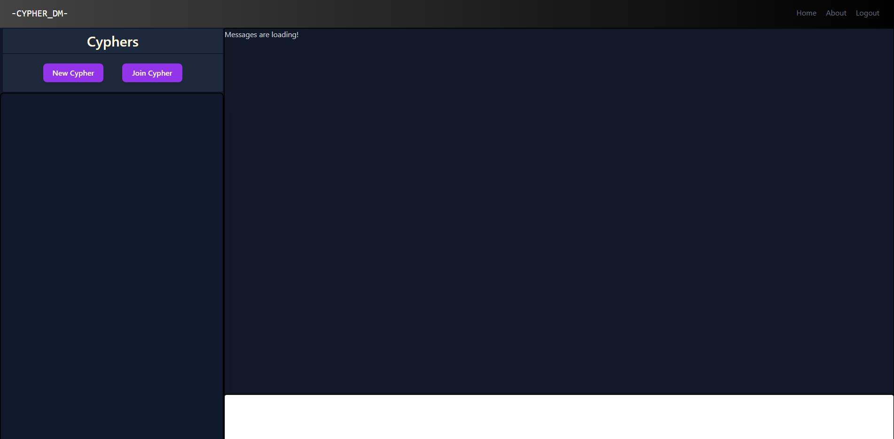

# Cypher DM

## Description
- Was to create a application that allows for multiple user to chat within a selected chat window.
- We built this project to allow users to create rooms and invite whomever to conversate with. 
- This solved understanding how to correctly structure GraphQL along with integrating it to our frontend utilizng the built in Websocket known as subscriptions. 

## Table of Contents
- [Installation](#installation)
- [Usage](#usage)
- [Credits](#credits)
- [License](#license)
- [Features](#features)

## Installation
Create a new repository on your GitHub account and clone it to your computer.

When you're ready to deploy, use the git add, git commit, and git push commands to save and push your code to your GitHub repository.

Navigate to your GitHub repository in the browser and then select the Settings tab on the right side of the page.

## Usage
[Project.io](https://sheltered-plateau-08067.herokuapp.com/)

## Credits

Github Contributors
[Ludie](https://github.com/veidul)
[Braulio](https://github.com/BraulioCP59)
[Naji](https://github.com/nodgyd)

Tech Stack
- Tailwind CSS
- GraphQL
- Apollo Server
- JWT
- Mongoose
- React
- MongoDB

## License

## Features
- User login and logout with hashed password
- React Framework
- A noSQL database that is store in the cloud. 
- Ability for user to create/join chat rooms. 
- 
- Winner logic that shows who is winning based on color order first green last red!
